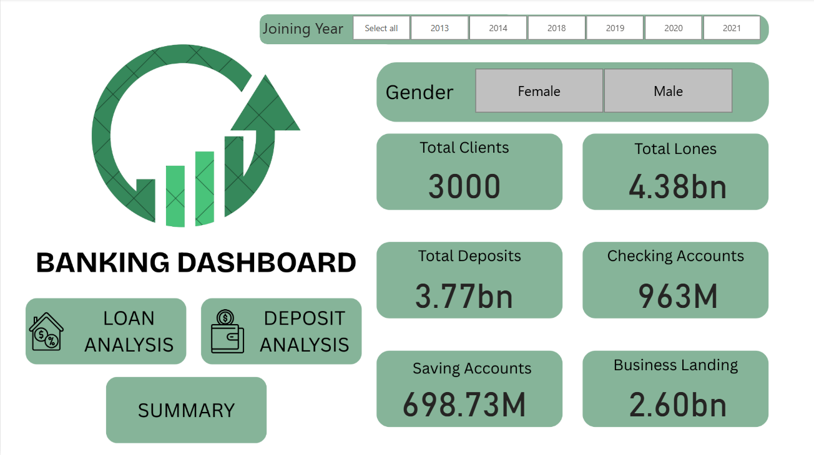

# Banking-Risk-Analysis

# 🏦 Banking Risk Analysis Dashboard

## 📌 Overview
A data-driven banking dashboard built using Python and Power BI
to analyze client behavior, loan risks, and deposit trends
across 3000+ customers.

## 🛠️ Tech Stack
- **Python** — Pandas, NumPy, Matplotlib, Seaborn
- **Power BI** — Interactive Dashboard
- **Dataset** — 3000 bank customers

## 📊 Key Insights
- Total Loans: **4.38 Billion**
- Total Deposits: **3.77 Billion**
- Saving Accounts: **698.73M**
- Checking Accounts: **963M**

## 🔍 Features
- Gender-wise and year-wise filtering
- Loan Analysis & Deposit Analysis
- Summary Dashboard with KPIs

## 📷 Dashboard Preview

